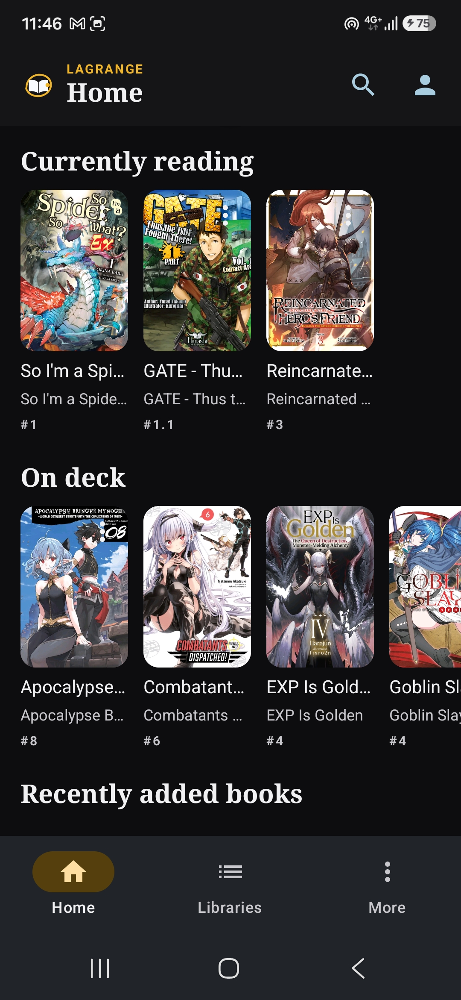
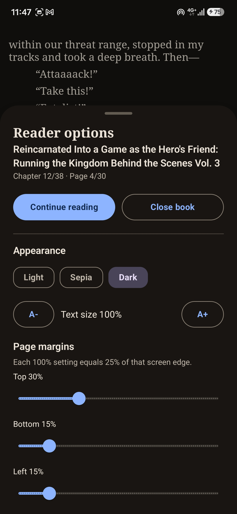
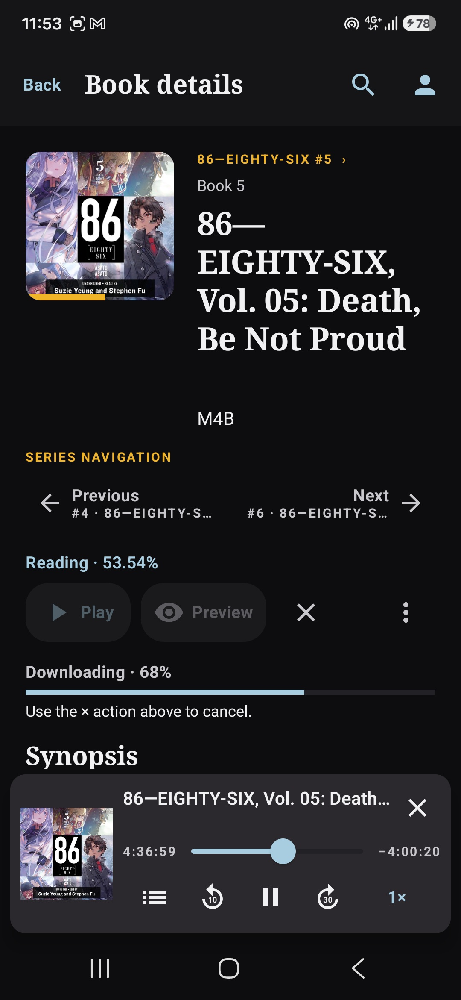
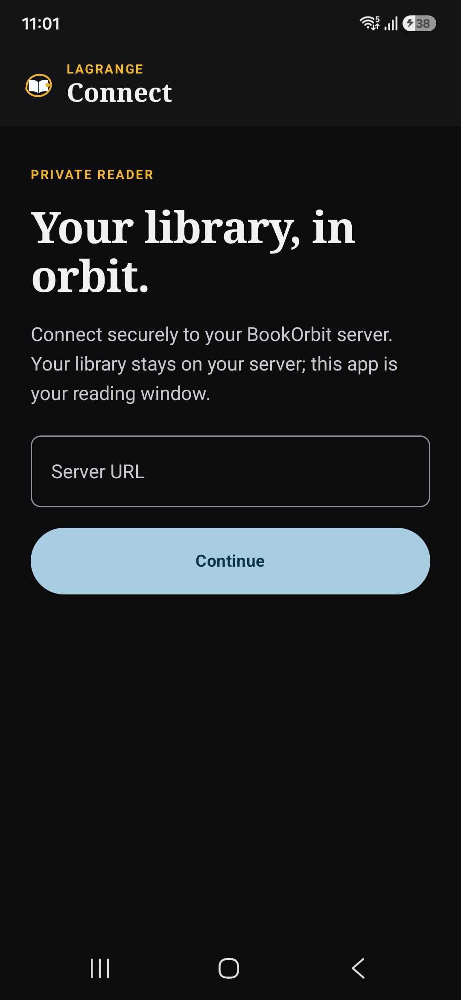
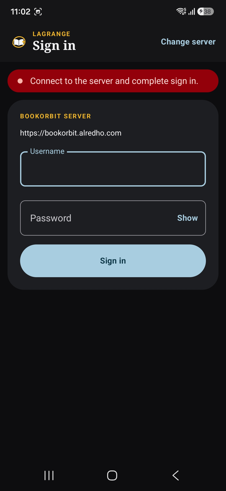
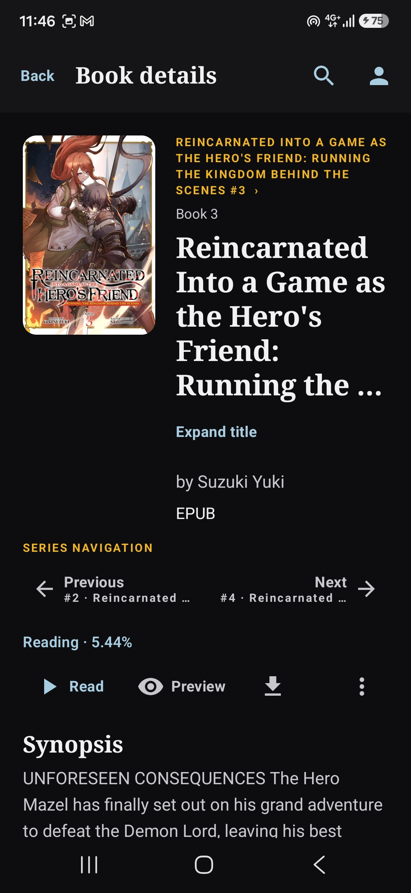
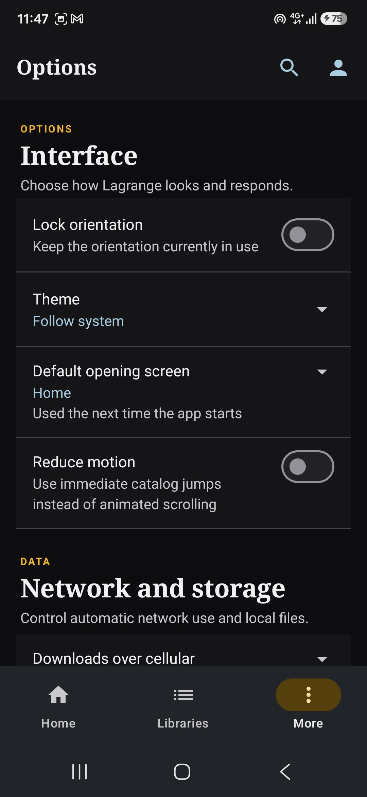
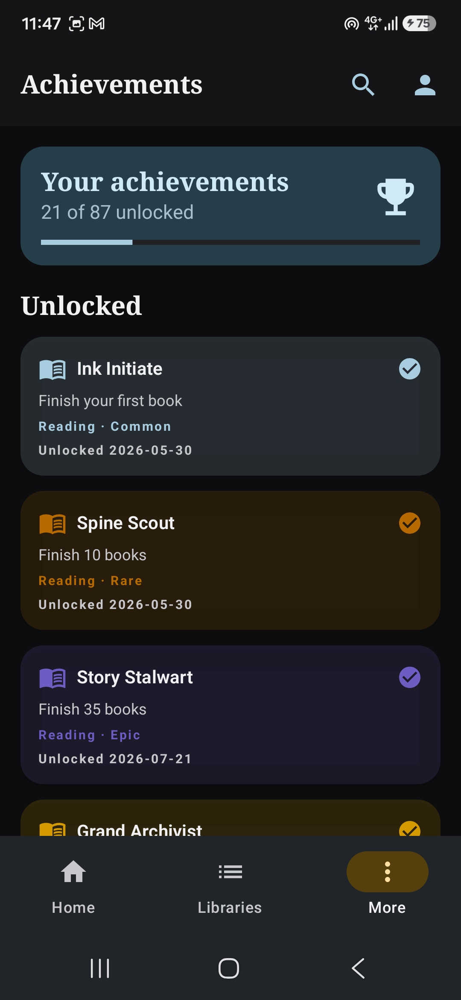
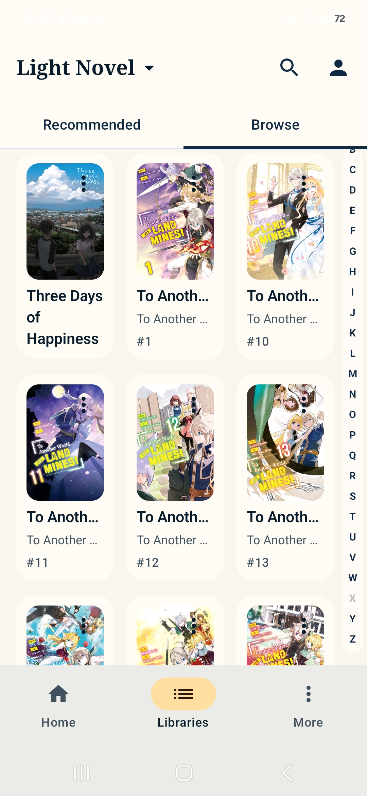

# Lagrange Reader

<div align="center">


# Lagrange Reader

An offline-first Android reader for BookOrbit.

[](LICENSE)
[](https://github.com/van-geaux/lagrange-reader/releases/tag/v1.2.2)
[](https://github.com/van-geaux/lagrange-reader/actions/workflows/android-debug.yml)

</div>

Lagrange Reader is an independent Android app for reading and listening to books hosted on [BookOrbit](https://github.com/BookOrbit). It started with a simple personal need: I love BookOrbit, but I wanted an app that lets me take my library with me and read offline.

Lagrange is a standalone native Android client, not a wrapper around the BookOrbit web interface. It has its own Compose browsing experience, Room-backed local catalog and caches, offline downloads, background synchronization, Readium-based publication readers, and persistent Media3 audiobook playback. BookOrbit supplies the authenticated server and library data; Lagrange owns the Android interface, local state, reading, listening, and offline behavior.

This is a community project, not an official BookOrbit application. Development was AI-assisted, with the implementation, testing, and product decisions reviewed by the project owner.

## Screenshots

The following screenshots show the main reading and library experience. More screenshots are available below.

<p align="center">
  
  
  
</p>

<details>
<summary>More screenshots</summary>

<p align="center">
  
  
  
  
</p>

<p align="center">
  
  
  
  
</p>

</details>

## Features

- **Offline-first library:** browse cached books and reopen downloaded EPUB, PDF, CBZ, and supported audiobook files without a connection.
- **Two-way sync:** send local reading/listening progress to BookOrbit, receive server-side progress and status changes, and replay queued offline progress after reconnecting.
- **EPUB reading:** paginated chapters, themes, text size, independent margins, chapter/page navigation, exact resume, and keep-awake mode.
- **PDF and comic reading:** Readium-powered PDF and image readers with fullscreen controls, page navigation, Preview isolation, and CBZ/online CBR support.
- **Audiobook playback:** compact player with seeking, chapter selection, playback speed, resume, and read-along support.
- **Library discovery:** Home, libraries, series, authors, search, achievements, local books, filters, sorting, and series navigation.
- **Reliable offline downloads:** progress, cancellation, retry/update flows, cache validation, and safe local replacement.
- **Personalized controls:** five app themes, reader themes, orientation lock, reduce motion, cellular download policy, cache management, and background-network controls.

## Supported formats

| Format | Online | Offline | Notes |
| --- | :---: | :---: | --- |
| EPUB / KEPUB | Yes | Yes | Full paginated reader with themes, margins, chapters, and resume. |
| PDF | Yes | Yes | Readium PDF reader with page navigation and resume. |
| CBZ | Yes | Yes | Image-based comic reader. |
| CBR / CB7 | Yes | Limited | Online page extraction is supported; offline reading requires the server and is not client-side RAR/7z extraction. |
| Audiobooks supported by BookOrbit | Yes | Yes | Readium audio playback with chapters, speed control, seeking, and resume. |

The following ebook formats are intentionally not supported at this time: MOBI, AZW, AZW3, and FB2. Conversion may be considered later. Audiobook and unusual comic files still benefit from broader device testing.

## Roadmap

Remaining follow-up work includes but is not limited to:

- Support for additional book formats; MOBI, AZW, AZW3, and FB2 remain unsupported.
- Optional client-side offline RAR/7z extraction for downloaded CBR/CB7; server-backed extraction remains the current behavior.
- Direct OIDC/SSO authentication after a BookOrbit provider and redirect contract are confirmed.
- Broader bulk actions for Local books beyond the implemented multi-select `Delete local` flow.
- Optional physical validation of Android API 33+ pull-down and lock-screen audiobook Back 10 / Forward 30 controls.

More details are in the [Roadmap](docs/roadmap.md)

## Building manually

### Requirements

- Windows, macOS, or Linux with a current Android Studio installation.
- JDK 17.
- Android SDK with API 35 installed.
- An Android device or emulator running API 26 or newer for manual testing.

Clone the repository, open it in Android Studio, and let it use the included Gradle wrapper. From a terminal at the repository root, the release build is:

```text
# macOS/Linux
./gradlew assembleRelease

# Windows PowerShell
.\gradlew.bat assembleRelease
```

The generated APK is:

```text
app/build/outputs/apk/release/app-release.apk
```

For local builds, the signed APK is generated at `app/build/outputs/apk/release/app-release.apk`. Distributed APKs are published as GitHub Release assets. Keep `release-key.jks` and `keystore.properties` backed up securely; they are intentionally ignored by Git.

Useful verification commands are:

```text
# macOS/Linux
./gradlew testDebugUnitTest lintDebug assembleDebug assembleDebugAndroidTest

# Windows PowerShell
.\gradlew.bat testDebugUnitTest lintDebug assembleDebug assembleDebugAndroidTest
```

For machine setup details and the manual test matrix, see [`docs/setup.md`](docs/setup.md) and [`docs/testing.md`](docs/testing.md).

## Design inspiration and attributions

Lagrange Reader's interface and interaction ideas were informed by the clarity and workflows of [Plex](https://www.plex.tv/), [Komga](https://komga.org/), [Audiobookshelf](https://www.audiobookshelf.org/), and [Suwayomi](https://suwayomi.org/). These projects are inspirations only; Lagrange Reader is independently developed and is not affiliated with, endorsed by, or sponsored by them.

## Relationship with BookOrbit

I have not yet asked the BookOrbit maintainers for permission to distribute or promote this client. I want to test it further first, roughly another two to three weeks of real world use, before starting that conversation. The app is independent, and its name, logo, and documentation should not be read as an endorsement by the BookOrbit maintainers.

## License and acknowledgements

The project uses the custom [`LICENSE`](LICENSE), which allows free personal and non-commercial use, modification, building, and redistribution. Commercial rights are reserved to the project owner. This is source-available, but it is not an OSI-approved open-source license.

See [`docs/privacy.md`](docs/privacy.md) for the app's local-data and network behavior. The project builds on BookOrbit, Readium, AndroidX, Jetpack Compose, Kotlin, Media3, OkHttp, Room, and other open-source libraries; their respective licenses and notices remain authoritative.

Thank you to the BookOrbit maintainers and contributors for the server and library experience that inspired this app, to the Readium Foundation and open-source library authors whose work makes the reader possible, and to everyone who tests Lagrange and reports issues.
