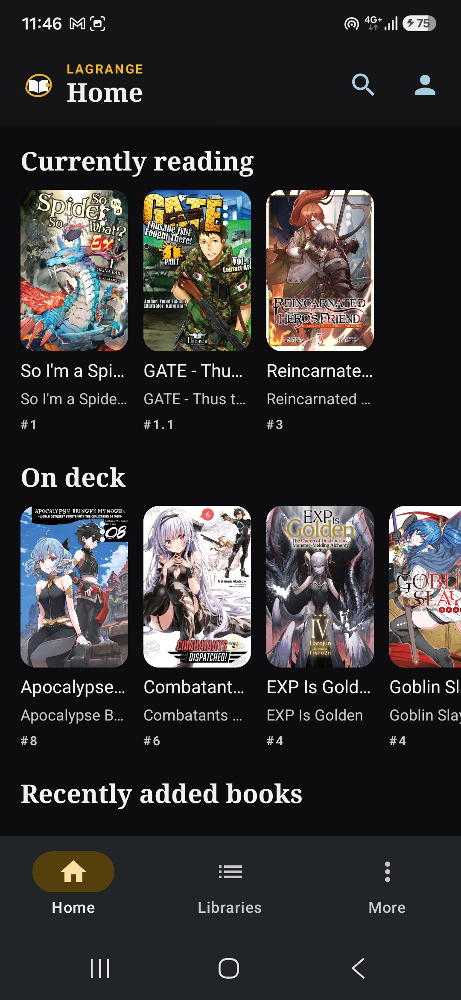
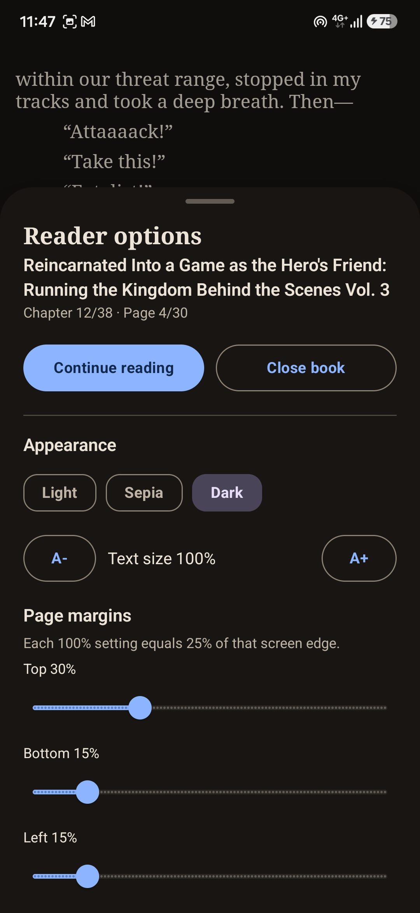
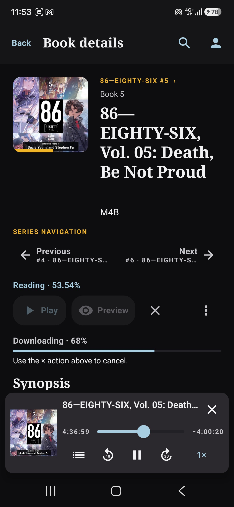
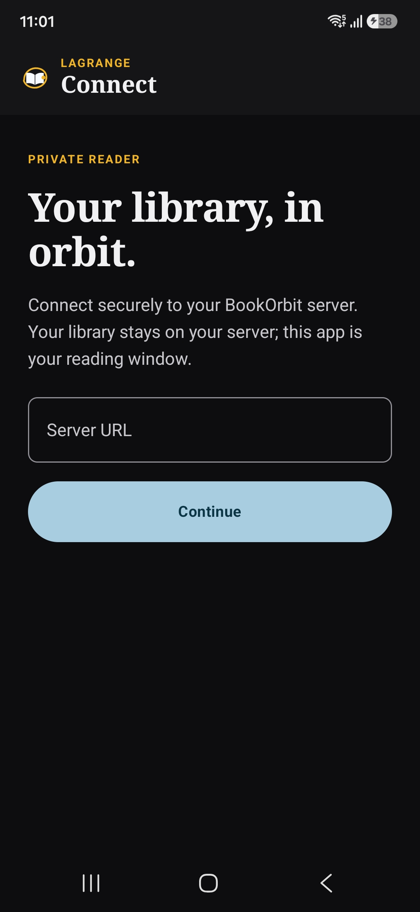
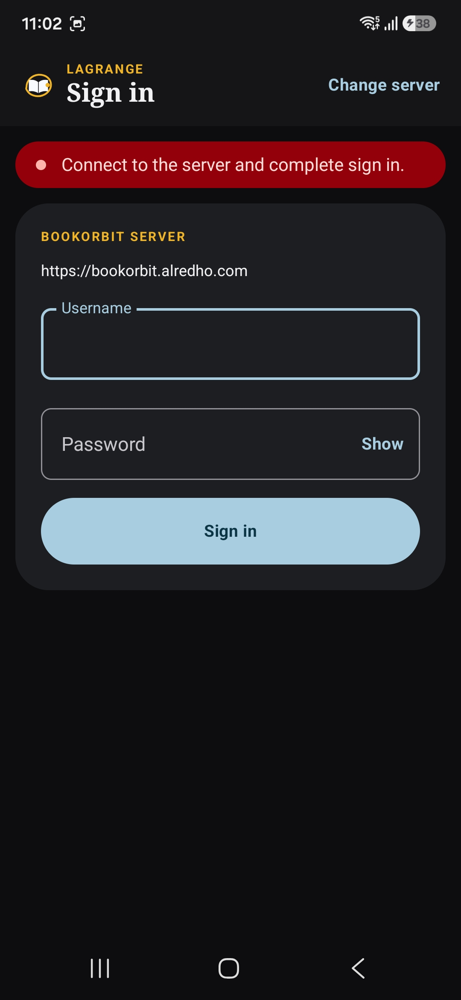
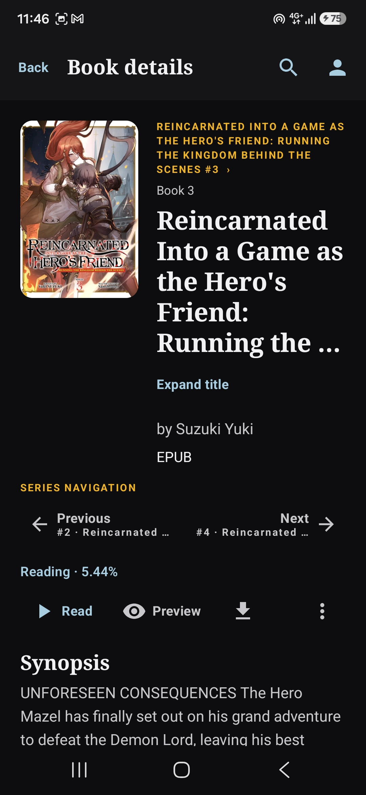
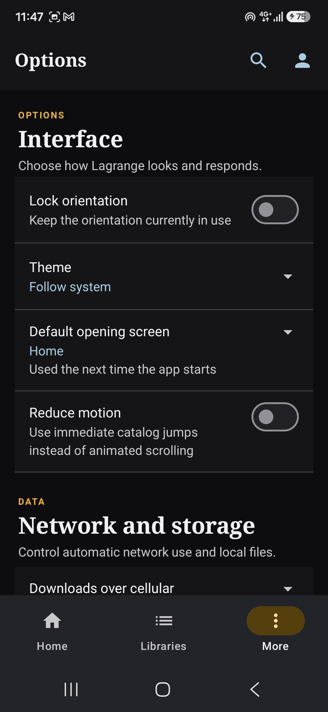
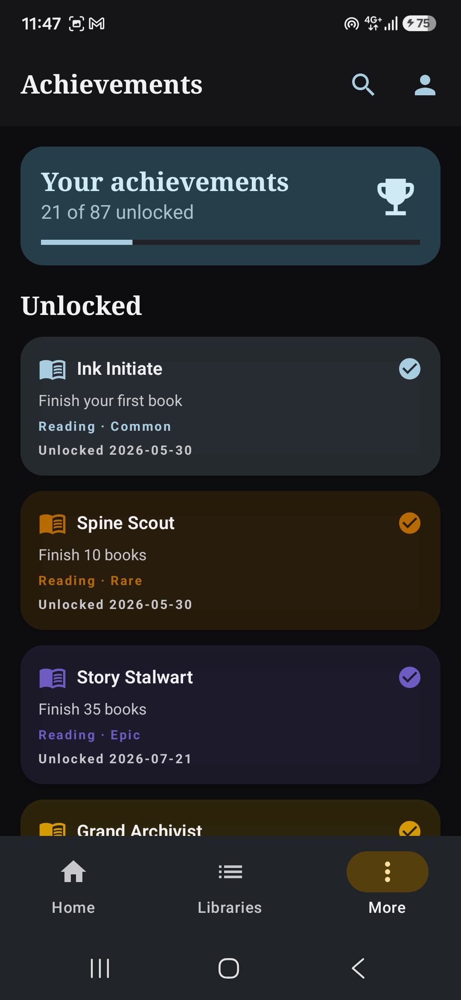
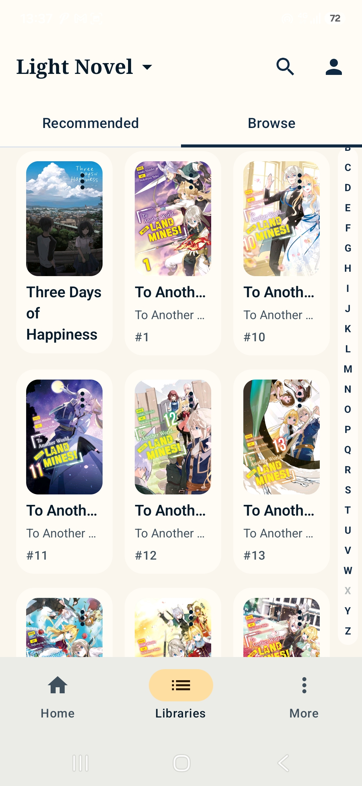

# Lagrange Reader

<div align="center">


# Lagrange Reader

An offline-first Android reader for BookOrbit.

[](LICENSE)
[](https://github.com/van-geaux/lagrange-reader/releases/tag/v1.4.0)
[](https://github.com/van-geaux/lagrange-reader/actions/workflows/android-debug.yml)

</div>

Lagrange Reader is an independent Android app for reading and listening to books hosted on [BookOrbit](https://github.com/BookOrbit). It started with a simple personal need: I love BookOrbit, but I wanted an app that lets me take my library with me and read offline.

Lagrange is a standalone native Android client, not a wrapper around the BookOrbit web interface. It has its own Compose browsing experience, Room-backed local catalog and caches, offline downloads, background synchronization, Readium-based publication readers, and persistent Media3 audiobook playback. BookOrbit supplies the authenticated server and library data; Lagrange owns the Android interface, local state, reading, listening, and offline behavior.

This is a community project, not an official BookOrbit application. Development was AI-assisted, with the implementation, testing, and product decisions reviewed by the project owner.

## Screenshots

The following screenshots show the main reading and library experience. More screenshots are available below.

<p align="center">
  
  
  
</p>

<details>
<summary>More screenshots</summary>

<p align="center">
  
  
  
  
</p>

<p align="center">
  
  
  
  
</p>

</details>

## Features

- **Offline-first library:** browse cached books and reopen downloaded EPUB, PDF, CBZ, and supported audiobook files without a connection.
- **Two-way sync:** send local reading/listening progress to BookOrbit, receive server-side progress and status changes, and replay queued offline progress after reconnecting.
- **EPUB reading:** paginated chapters, themes, text size, independent margins, chapter/page navigation, exact resume, keep-awake mode, and per-library font selection through grouped normal/accessibility menus, plus one imported custom `.ttf`/`.otf` font.
- **PDF and comic reading:** Readium-powered PDF and image readers with fullscreen controls, page navigation, Preview isolation, and CBZ/online CBR support.
- **Audiobook playback:** compact player with seeking, chapter selection, playback speed, resume, and read-along support.
- **Library discovery:** Home, libraries, series, authors, search, achievements, local books, filters, sorting, and series navigation.
- **Reliable offline downloads:** progress, cancellation, retry/update flows, cache validation, and safe local replacement.
- **Personalized controls:** five app themes, reader themes, orientation lock, reduce motion, cellular download policy, cache management, and background-network controls.

## Supported formats

| Format | Online | Offline | Notes |
| --- | :---: | :---: | --- |
| EPUB / KEPUB | Yes | Yes | Full paginated reader with themes, margins, chapters, and resume. |
| PDF | Yes | Yes | Readium PDF reader with page navigation and resume. |
| CBZ | Yes | Yes | Image-based comic reader. |
| CBR / CB7 | Yes | Yes | Online page extraction is supported; offline reading uses client-side RAR4/RAR5/7z extraction into a cached CBZ. User-confirmed offline opening works. |
| Audiobooks supported by BookOrbit | Yes | Yes | Readium audio playback with chapters, speed control, seeking, and resume. |

The following ebook formats are intentionally not supported at this time: MOBI, AZW, AZW3, and FB2. Conversion may be considered later. Audiobook and unusual comic files still benefit from broader device testing.

## Sync accuracy by format

| Format | What syncs | Accuracy notes |
| --- | --- | --- |
| EPUB / KEPUB | Overall `percentage`, plus a one-based chapter/page fallback | Server `percentage` is generally an accurate overall-progress signal, but the exact in-chapter/on-screen location is approximate since exact Readium `Locator`/CFI is not uploaded. Same-device resume from the local Readium `Locator` is usually exact. |
| PDF | Page-index progress | Synchronizes the current page index; subject to queue/throttle and network delay, so it does not guarantee pixel- or viewport-exact cross-device resume. |
| CBZ | Page-index progress | Same page-index synchronization and delay characteristics as PDF. |
| CBR / CB7 | Page-index progress | Same page-index synchronization and delay characteristics as PDF; offline reading uses client-side extraction into a cached CBZ. |
| Audiobooks | Periodic position/percentage snapshots | Position is sampled locally and queued/throttled before upload, so server-side progress reflects a periodic snapshot rather than an exact wall-clock playback timestamp. |
| Unsupported formats (MOBI, AZW, AZW3, FB2) | Nothing | No reader or progress sync is available for these formats. |

Progress uploads are queued and throttled rather than sent immediately, and can be delayed by connectivity; a clean reader/player close attempts a best-effort flush of the pending queue but is not guaranteed to complete before the app fully closes offline.

## Privacy, telemetry, and data

Lagrange does not include behavioral telemetry, advertising tracking, an analytics SDK, or a remote crash-reporting service. It does not collect usage events or device identifiers for the Lagrange project.

The app does send functional requests to the BookOrbit server that you configure. Depending on the features you use, this includes authentication, library and book metadata, cover and media requests, reading/listening progress, reading-status changes, personal ratings, Statistics requests, and server reading-history requests. These requests are required for the app to browse, synchronize, read, listen, and recover progress.

Lagrange stores app data locally in its private Android sandbox, including session cookies, cached catalog data, downloaded files, reader state, queued progress, preferences, and exact local audiobook session history. Exact local audiobook session-history events are not uploaded by Lagrange; the server-history view only reads analytics records already stored by BookOrbit.

BookOrbit may retain or log normal server-side request information such as account activity, request timestamps, and network metadata. That server-side retention is controlled by the BookOrbit server and its administrator, not by Lagrange. Use HTTPS for the configured server; cleartext HTTP can expose credentials, session tokens, metadata, progress, and content on the network. See [`docs/privacy.md`](docs/privacy.md) for more details.

## Android permissions

Lagrange requests only the permissions needed for networking, media playback, and playback notifications:

| Permission | Why it is requested |
| --- | --- |
| `INTERNET` | Connect to the configured BookOrbit server for authentication, catalog data, content, synchronization, and media playback. |
| `ACCESS_NETWORK_STATE` | Detect whether a network is available and apply the app's online/offline and background-network behavior. |
| `FOREGROUND_SERVICE` | Keep audiobook playback running in a foreground service when the app is backgrounded. |
| `FOREGROUND_SERVICE_MEDIA_PLAYBACK` | Declare that the foreground service is used for media playback under current Android rules. |
| `POST_NOTIFICATIONS` | Show audiobook playback controls and other user-visible notifications on Android versions that require notification permission. |

The app does not request location, contacts, camera, microphone, phone, SMS, storage-wide, or advertising-ID permissions.

## Lagrange and BookOrbit feature comparison

BookOrbit is the server and web platform; Lagrange is an independent Android client. The table describes the current integration boundary rather than implying that the two projects share the same UI or implementation.

| Capability | BookOrbit server/web platform | Lagrange Android client |
| --- | --- | --- |
| Authentication | Provides authenticated accounts, server sessions, configured OIDC providers, and public state/callback APIs; current stock server releases accept only the web callback. | Uses native username/password plus the implemented interim Open server sign-in WebView. Native AppAuth remains deferred until mobile redirect support is deployed; see [OIDC / SSO Authentication](docs/oidc-authentication.md). |
| Library and catalog | Owns libraries, books, authors, series, metadata, scanning, and catalog APIs. | Browses BookOrbit libraries and caches catalog data for offline fallback. |
| Reading and listening | Serves book files, reader data, progress APIs, and audiobook media. | Provides native EPUB, PDF, comic, and audiobook readers with resume, themes, navigation, and playback controls. |
| Offline use | Remains the connected source of server content. | Downloads supported content and reopens it offline, including CBR/CB7 files via client-side RAR4/RAR5/7z extraction into a cached CBZ. |
| Progress and status | Stores reading/listening progress and book statuses. | Queues progress offline, synchronizes it, and exposes the server status controls in the Android UI. |
| Ratings and metadata sources | Owns book metadata, provider IDs, and per-user book data. | Displays and updates supported per-user ratings and opens centralized links for known metadata providers. |
| Audiobook sessions | Stores server reading sessions and reading attempts as analytics/history records. | Shows server history after local history; local exact-position audiobook sessions remain device-only and seekable. |
| Statistics | Provides summary, daily reading, heatmap, source, peak-hour, timeline, goal, completion, pace, and related statistics APIs. | Currently consumes the summary and daily-reading endpoints in the lazy-loaded Statistics screen. |
| Achievements | Owns achievement definitions and user progress. | Provides an Achievements destination that loads the user's server-backed achievements. |
| Annotations, bookmarks, and notes | Provides server modules and APIs for these reading records. | Not currently exposed as a dedicated Lagrange feature. |
| Integrations and administration | Includes integrations such as OPDS, KOReader, Kobo, Readwise, StoryGraph, notifications, and administrative/audit tools. | Focuses on the Android reading/listening experience and does not expose the server administration surface. |

## Roadmap

Remaining follow-up work includes but is not limited to:

- Support for additional book formats; MOBI, AZW, AZW3, and FB2 remain unsupported.
- Implemented and user-validated the interim Open server sign-in WebView. Native AppAuth follows after BookOrbit mobile-redirect support from upstream PR #554 or an equivalent server change is deployed; see [OIDC / SSO Authentication](docs/oidc-authentication.md).
- Broader bulk actions for Local books beyond the implemented multi-select `Delete local` flow.

More details are in the [Roadmap](docs/roadmap.md)

## Building manually

### Requirements

- Windows, macOS, or Linux with a current Android Studio installation.
- JDK 17.
- Android SDK with API 35 installed.
- An Android device or emulator running API 26 or newer for manual testing.

Clone the repository, open it in Android Studio, and let it use the included Gradle wrapper. From a terminal at the repository root, the release build is:

```text
# macOS/Linux
./gradlew assembleRelease

# Windows PowerShell
.\gradlew.bat assembleRelease
```

The generated APK is:

```text
app/build/outputs/apk/release/app-release.apk
```

For local builds, the signed APK is generated at `app/build/outputs/apk/release/app-release.apk`. Distributed APKs are published as GitHub Release assets. Keep `release-key.jks` and `keystore.properties` backed up securely; they are intentionally ignored by Git.

Useful verification commands are:

```text
# macOS/Linux
./gradlew testDebugUnitTest lintDebug assembleDebug assembleDebugAndroidTest

# Windows PowerShell
.\gradlew.bat testDebugUnitTest lintDebug assembleDebug assembleDebugAndroidTest
```

For machine setup details and the manual test matrix, see [`docs/setup.md`](docs/setup.md) and [`docs/testing.md`](docs/testing.md).

## Design inspiration and attributions

Lagrange Reader's interface and interaction ideas were informed by the clarity and workflows of [Plex](https://www.plex.tv/), [Komga](https://komga.org/), [Audiobookshelf](https://www.audiobookshelf.org/), and [Suwayomi](https://suwayomi.org/). These projects are inspirations only; Lagrange Reader is independently developed and is not affiliated with, endorsed by, or sponsored by them.

## Relationship with BookOrbit

I have not yet asked the BookOrbit maintainers for permission to distribute or promote this client. I want to test it further first, roughly another two to three weeks of real world use, before starting that conversation. The app is independent, and its name, logo, and documentation should not be read as an endorsement by the BookOrbit maintainers.

## License and acknowledgements

The project uses the custom [`LICENSE`](LICENSE), which allows free personal and non-commercial use, modification, building, and redistribution. Commercial rights are reserved to the project owner. This is source-available, but it is not an OSI-approved open-source license.

See [`docs/privacy.md`](docs/privacy.md) for the app's local-data and network behavior. The project builds on BookOrbit, Readium, AndroidX, Jetpack Compose, Kotlin, Media3, OkHttp, Room, and other open-source libraries; their respective licenses and notices remain authoritative.

Thank you to the BookOrbit maintainers and contributors for the server and library experience that inspired this app, to the Readium Foundation and open-source library authors whose work makes the reader possible, and to everyone who tests Lagrange and reports issues.
